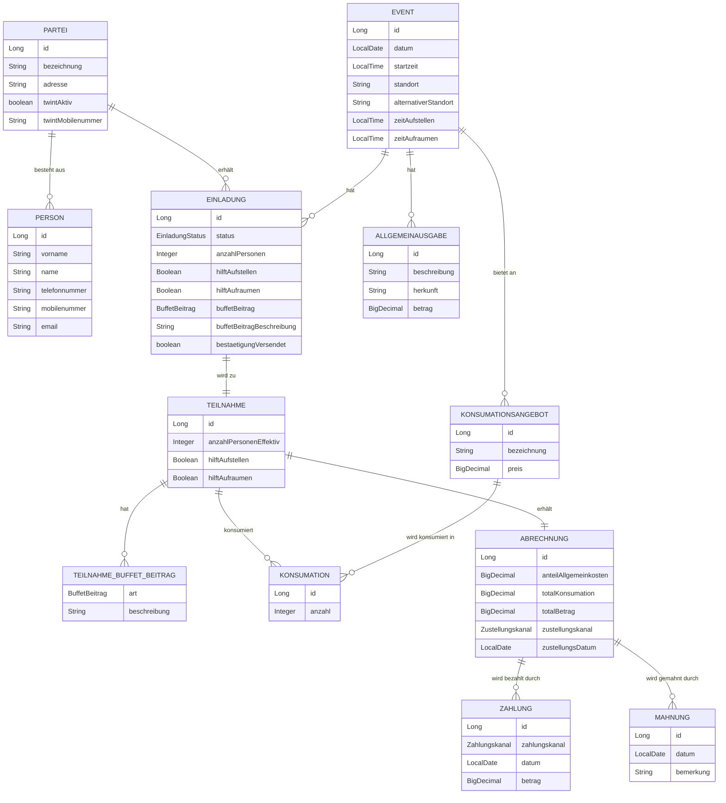

# Architekturdiagramm Quartierfest-Backend

## Schichtenarchitektur

### CORS-Konfiguration

`WebConfig.java` konfiguriert CORS global für alle `/api/**`-Endpunkte:

| Einstellung | Wert |
|---|---|
| Erlaubter Origin | `http://localhost:4200` (Angular-Dev-Server) |
| Erlaubte Methoden | `GET`, `POST`, `PUT`, `DELETE` |
| Erlaubte Headers | `*` |

Andere Origins werden vom Browser blockiert. Server-seitige Clients (z.B. `RestTemplate` in Integrationstests) sind von CORS nicht betroffen.

---

## Domänenmodell (Entity-Beziehungen)

---

## REST-Endpunkte

| Domain              | Endpunkt                      | GET | POST | PUT | DELETE |
|---------------------|-------------------------------|:---:|:----:|:---:|:------:|
| Person              | `/api/persons`                | ✓   | ✓    | ✓   | ✓      |
| Partei              | `/api/parteien`               | ✓   | ✓    | ✓   | ✓      |
| Event               | `/api/events`                 | ✓   | ✓    | ✓   | ✓      |
| Einladung           | `/api/einladungen`            | ✓   | ✓    | —   | ✓      |
| Teilnahme           | `/api/teilnahmen`             | ✓   | ✓    | —   | ✓      |
| Konsumationsangebot | `/api/konsumationsangebote`   | ✓   | ✓    | —   | ✓      |
| Konsumation         | `/api/konsumationen`          | ✓   | ✓    | —   | ✓      |
| Allgemeinausgabe    | `/api/allgemeinausgaben`      | ✓   | ✓    | —   | ✓      |
| Abrechnung          | `/api/abrechnungen`           | ✓   | ✓    | —   | ✓      |
| Zahlung             | `/api/zahlungen`              | ✓   | ✓    | —   | ✓      |
| Mahnung             | `/api/mahnungen`              | ✓   | ✓    | —   | ✓      |

---

## Bekannte technische Schulden

> Identifiziert durch SonarQube-Analyse 2026-05-01. Details und Massnahmen → `specs/TODO.md`.

| # | Bereich | Befund | Schweregrad |
|---|---------|--------|-------------|
| AUTH-001 | Sicherheit | Keine Authentifizierung/Autorisierung — alle `/api/**`-Endpunkte offen | CRITICAL |
| CORS-001 | Infrastruktur | `allowedOrigins("localhost:4200")` hardcoded, kein Profil-Support | MAJOR |
| PERF-001 | Performance | `FetchType.EAGER` auf `Partei.personen` + `Teilnahme.buffetBeitraege` — N+1-Risiko | MAJOR |
| VALID-001 | Validierung | Kein `@Valid` auf Controllern — Pflichtfeldverletzungen liefern HTTP 500 statt 400 | MAJOR |
| REFACT-001 | Code-Qualität | 8 Controller + 10 Services mit identischem CRUD-Boilerplate, kein `BaseCrud*` | MINOR |
| TEST-001 | Tests | 13 IT-Klassen duplizieren `setUp()`/`tearDown()`/`setupPost()`/`tryDelete()` | MINOR |

---

## Traceability

> Automatisch generiert durch Traceability-Manager — Stand: 2026-05-01
> UC-Abdeckung: 11/13 vollständig | 2 mit Lücken | 0 nicht implementiert

### UC × Implementierung × Test

| UC-ID | Titel | Endpunkt(e) | TC-ID(s) | IT-Klasse | Status |
|-------|-------|-------------|----------|-----------|--------|
| UC-001 | Personendaten verwalten | GET/POST/PUT/DELETE `/api/persons` | TC-001, TC-002, TC-029 | PersonVerwaltenIT | ✅ Vollständig |
| UC-002 | Parteien verwalten | GET/POST/PUT/DELETE `/api/parteien` | TC-004, TC-005, TC-030 | ParteiVerwaltenIT | ✅ Vollständig |
| UC-003 | Event anlegen | GET/POST/PUT/DELETE `/api/events` | TC-006, TC-007, TC-031 | EventAnlegenIT | ✅ Vollständig |
| UC-004 | Einladung verwalten | GET/POST/DELETE `/api/einladungen` | TC-008, TC-009, TC-010 | EinladungVerwaltenIT | ✅ Vollständig |
| UC-005 | Teilnahme erfassen | GET/POST/DELETE `/api/teilnahmen` | TC-011, TC-012, TC-033 | TeilnahmeVerwaltenIT | ✅ Vollständig |
| UC-006 | Bestätigung versenden | POST `/api/einladungen` (Upsert, Flag `bestaetigungVersendet`) | TC-013 | BestaetigungVerwaltenIT | ✅ Vollständig |
| UC-007 | Allgemeinausgaben verwalten | GET/POST/DELETE `/api/allgemeinausgaben` | TC-014, TC-015 | AllgemeinausgabeVerwaltenIT | ✅ Vollständig |
| UC-008 | Konsumationsangebot verwalten | GET/POST/DELETE `/api/konsumationsangebote` | TC-016 | KonsumationsangebotVerwaltenIT | ✅ Vollständig |
| UC-009 | Konsumationsliste erstellen | GET `/api/konsumationsangebote`, GET `/api/teilnahmen` | TC-018, TC-019 | KonsumationslisteErstellenIT | ⚠ Teilimpl. |
| UC-010 | Konsumation übernehmen | GET/POST/DELETE `/api/konsumationen` | TC-020, TC-021 | KonsumationUebernehmenIT | ✅ Vollständig |
| UC-011 | Abrechnung erstellen | GET/POST/DELETE `/api/abrechnungen` | TC-022, TC-023 | AbrechnungErstellenIT | ⚠ Teilimpl. |
| UC-012 | Abrechnung zustellen | POST `/api/abrechnungen` (Upsert, Felder `zustellungskanal`, `zustellungsDatum`) | TC-024, TC-025, TC-032 | AbrechnungZustellenIT | ✅ Vollständig |
| UC-013 | Inkasso sicherstellen | GET/POST/DELETE `/api/zahlungen`, `/api/mahnungen` | TC-026, TC-027, TC-028 | InkassoSicherstellenIT | ✅ Vollständig |

> **Unit-Test-Abdeckung (zusätzlich):** 11 `*ControllerTest.java`-Klassen (`@WebMvcTest`) decken die HTTP-Schicht aller UC-Domänen ab. `ParteiServiceTest` testet die Geschäftslogik von UC-002 (Personenauflösung via `personenIds`). Diese Tests sind nicht TC-gebunden, referenzieren UCs aber via `@DisplayName("UC-XXX: ...")`.

### Offene Traceability-Lücken

- **UC-009** (Konsumationsliste erstellen): Kein dedizierter `GET /api/events/{id}/konsumationsliste`-Endpunkt; Frontend kombiniert Daten clientseitig. → Empfehlung: Endpunkt für Event-spezifische Konsumationsansicht implementieren
- **UC-011** (Abrechnung erstellen): Keine automatische Berechnung von `anteilAllgemeinkosten` / `totalKonsumation`; Werte werden manuell übergeben. → Empfehlung: Berechnungslogik im Service kapseln
