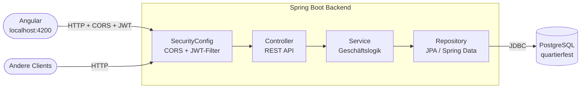
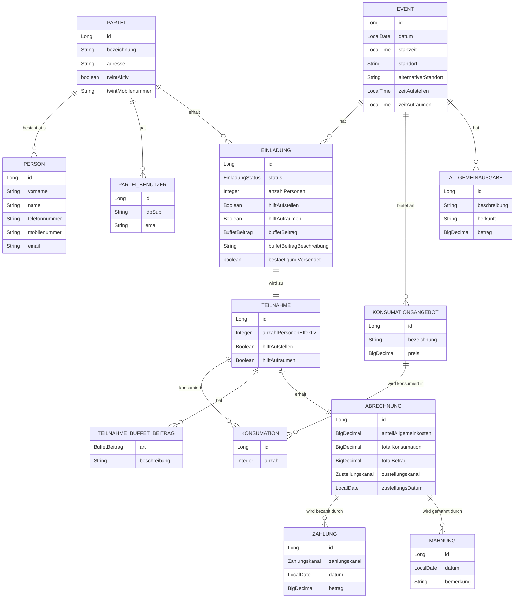

# Architekturdiagramm Quartierfest-Backend

## Schichtenarchitektur

### CORS-Konfiguration

`SecurityConfig.java` konfiguriert CORS global für alle `/api/**`-Endpunkte via `CorsConfigurationSource`-Bean:

| Einstellung | Wert |
|---|---|
| Erlaubter Origin | Property `cors.allowed-origins` (Default: `http://localhost:4200`) |
| Erlaubte Methoden | `GET`, `POST`, `PUT`, `DELETE` |
| Erlaubte Headers | `*` |

Andere Origins werden vom Browser blockiert. Server-seitige Clients (z.B. `RestTemplate` in Integrationstests) sind von CORS nicht betroffen.

### Sicherheit (JWT / Spring Security)

Alle `/api/**`-Endpunkte sind über Spring Security 7.x abgesichert. Die Absicherung ist profil-abhängig:

| Profil | SecurityFilterChain | Beschreibung |
|--------|---------------------|--------------|
| `prod` | JWT-Pflicht | Alle Requests benötigen ein gültiges Bearer-Token mit Rolle `ORGANISATOR` |
| kein / `test` / `dev` | `permitAll()` | Kein Token erforderlich — für lokale Entwicklung und Tests |

**JWT-Validierung (Profil `prod`):**
- Spring Security validiert das Bearer-Token via JWKS-Endpoint des IdP
- Konfiguration: `spring.security.oauth2.resourceserver.jwt.issuer-uri` in `application-prod.properties`
- Empfohlene IdP: Auth0 oder Supabase Auth (kostenloser Tier)
- Rolle `ORGANISATOR`: voller Zugriff auf alle Domänen

**Noch nicht implementiert (AUTH-002 — UC-014/UC-015/UC-016):**
- Rolle `PARTEI`: Eingeschränkter Zugriff auf eigene Teilnahme via `@PreAuthorize` + Custom `PermissionEvaluator` (JWT `sub` → `ParteiBenutzer` → `Partei` → Teilnahme-Lookup)
- Frontend-Login-Flow: PKCE-Redirect, `@auth0/auth0-angular`, HTTP-Interceptor, Route Guard
- `ParteiBenutzer`-Domain: neue Entity + Endpunkte `GET/POST/DELETE /api/parteibenutzer` (UC-015)
- Neuer Endpunkt `PUT /api/teilnahmen/{id}` und `GET /api/teilnahmen/meine` (UC-016)
- Self-Registration ist explizit **nicht geplant** — Accounts werden durch den Organisator im Auth0-Dashboard angelegt

---

## Domänenmodell (Entity-Beziehungen)

---

## REST-Endpunkte

| Domain              | Endpunkt                      | GET | POST | PUT | DELETE | Hinweis |
|---------------------|-------------------------------|:---:|:----:|:---:|:------:|---------|
| Person              | `/api/persons`                | ✓   | ✓    | ✓   | ✓      | — |
| Partei              | `/api/parteien`               | ✓   | ✓    | ✓   | ✓      | — |
| Event               | `/api/events`                 | ✓   | ✓    | ✓   | ✓      | — |
| Einladung           | `/api/einladungen`            | ✓   | ✓    | —   | ✓      | — |
| Teilnahme           | `/api/teilnahmen`             | ✓   | ✓    | —   | ✓      | — |
| Teilnahme (PARTEI)  | `/api/teilnahmen/meine`       | 🔲  | —    | —   | —      | UC-016: ausstehend; gibt eigene Teilnahme zurück |
| Teilnahme (update)  | `/api/teilnahmen/{id}`        | —   | —    | 🔲  | —      | UC-016: ausstehend; PARTEI und ORGANISATOR |
| Konsumationsangebot | `/api/konsumationsangebote`   | ✓   | ✓    | —   | ✓      | — |
| Konsumation         | `/api/konsumationen`          | ✓   | ✓    | —   | ✓      | — |
| Allgemeinausgabe    | `/api/allgemeinausgaben`      | ✓   | ✓    | —   | ✓      | — |
| Abrechnung          | `/api/abrechnungen`           | ✓   | ✓    | —   | ✓      | — |
| Zahlung             | `/api/zahlungen`              | ✓   | ✓    | —   | ✓      | — |
| Mahnung             | `/api/mahnungen`              | ✓   | ✓    | —   | ✓      | — |
| ParteiBenutzer      | `/api/parteibenutzer`         | 🔲  | 🔲   | —   | 🔲     | UC-015: ausstehend |

---

## Bekannte technische Schulden

> Identifiziert durch SonarQube-Analyse 2026-05-01. Details und Massnahmen → `specs/TODO.md`.

| # | Bereich | Befund | Schweregrad | Stand |
|---|---------|--------|-------------|-------|
| AUTH-001 | Sicherheit | Keine Authentifizierung/Autorisierung — alle `/api/**`-Endpunkte offen | CRITICAL | ✅ Behoben 2026-05-09 |
| AUTH-002 | Sicherheit | Login-Frontend (PKCE), Rolle PARTEI, ParteiBenutzer-Domain, PUT Teilnahme | MAJOR | Offen — UC-014..016 spezifiziert |
| CORS-001 | Infrastruktur | `allowedOrigins("localhost:4200")` hardcoded, kein Profil-Support | MAJOR | ✅ Behoben 2026-05-09 |
| DEPLOY-001 | Deployment | Kein Spring-Profil für Production | MAJOR | ✅ Behoben 2026-05-09 |
| DEPLOY-002 | Deployment | `localhost:8080` hardcoded in allen 11 Angular-Services — Production-Build zeigt gegen localhost | MAJOR | ✅ Behoben 2026-05-12 |
| PERF-001 | Performance | `FetchType.EAGER` auf `Partei.personen` + `Teilnahme.buffetBeitraege` — N+1-Risiko | MAJOR | Offen |
| VALID-001 | Validierung | Kein `@Valid` auf Controllern — Pflichtfeldverletzungen liefern HTTP 500 statt 400 | MAJOR | ✅ Behoben 2026-05-12 |
| REFACT-001 | Code-Qualität | 8 Controller + 10 Services mit identischem CRUD-Boilerplate, kein `BaseCrud*` | MINOR | Offen |
| DEPLOY-003 | CI/CD | Kein GitHub Actions Workflow — Tests laufen nur lokal | MAJOR | Offen |
| TEST-001 | Tests | 13 IT-Klassen duplizieren `setUp()`/`tearDown()`/`setupPost()`/`tryDelete()` | MINOR | Offen |

---

## Traceability

> Automatisch generiert durch Traceability-Manager — Stand: 2026-05-15
> UC-Abdeckung: 11/13 vollständig | 2 mit Lücken (UC-009, UC-011) | 3 ausstehend (UC-014, UC-015, UC-016)

### UC × Implementierung × Test

| UC-ID | Titel | Endpunkt(e) | TC-ID(s) | IT-Klasse | Status |
|-------|-------|-------------|----------|-----------|--------|
| UC-001 | Personendaten verwalten | GET/POST/PUT/DELETE `/api/persons` | TC-001, TC-002, TC-029 | PersonVerwaltenIT | ✅ Vollständig |
| UC-002 | Parteien verwalten | GET/POST/PUT/DELETE `/api/parteien` | TC-004, TC-005, TC-030 | ParteiVerwaltenIT | ✅ Vollständig |
| UC-003 | Event anlegen | GET/POST/PUT/DELETE `/api/events` | TC-006, TC-007, TC-031 | EventAnlegenIT | ✅ Vollständig |
| UC-004 | Einladung verwalten | GET/POST/DELETE `/api/einladungen` | TC-008, TC-009, TC-010 | EinladungVerwaltenIT | ✅ Vollständig |
| UC-005 | Teilnahme erfassen | GET/POST/DELETE `/api/teilnahmen` | TC-011, TC-012, TC-033 | TeilnahmeVerwaltenIT | ✅ Vollständig |
| UC-006 | Bestätigung versenden | POST `/api/einladungen` (Upsert, Flag `bestaetigungVersendet`) | TC-013 | BestaetigungVerwaltenIT | ✅ Vollständig |
| UC-007 | Allgemeinausgaben verwalten | GET/POST/DELETE `/api/allgemeinausgaben` | TC-014, TC-015 | AllgemeinausgabeVerwaltenIT | ✅ Vollständig |
| UC-008 | Konsumationsangebot verwalten | GET/POST/DELETE `/api/konsumationsangebote` | TC-016 | KonsumationsangebotVerwaltenIT | ✅ Vollständig |
| UC-009 | Konsumationsliste erstellen | GET `/api/konsumationsangebote`, GET `/api/teilnahmen` | TC-018, TC-019 | KonsumationslisteErstellenIT | ⚠ Teilimpl. |
| UC-010 | Konsumation übernehmen | GET/POST/DELETE `/api/konsumationen` | TC-020, TC-021 | KonsumationUebernehmenIT | ✅ Vollständig |
| UC-011 | Abrechnung erstellen | GET/POST/DELETE `/api/abrechnungen` | TC-022, TC-023 | AbrechnungErstellenIT | ⚠ Teilimpl. |
| UC-012 | Abrechnung zustellen | POST `/api/abrechnungen` (Upsert, Felder `zustellungskanal`, `zustellungsDatum`) | TC-024, TC-025, TC-032 | AbrechnungZustellenIT | ✅ Vollständig |
| UC-013 | Inkasso sicherstellen | GET/POST/DELETE `/api/zahlungen`, `/api/mahnungen` | TC-026, TC-027, TC-028 | InkassoSicherstellenIT | ✅ Vollständig |
| UC-014 | Benutzer anmelden | Backend: JWKS-Validierung via AUTH-001 | — | — | 🔲 Ausstehend (Frontend) |
| UC-015 | Parteibenutzer verwalten | GET/POST/DELETE `/api/parteibenutzer` | TC-034, TC-035 (geplant) | ParteibenutzerVerwaltenIT (geplant) | 🔲 Ausstehend |
| UC-016 | Teilnahme bestätigen | GET `/api/teilnahmen/meine`, PUT `/api/teilnahmen/{id}` | TC-036, TC-037 (geplant) | TeilnahmeBestaetigenIT (geplant) | 🔲 Ausstehend |

> **Unit-Test-Abdeckung (zusätzlich):** 11 `*ControllerTest.java`-Klassen (`@WebMvcTest`) decken die HTTP-Schicht aller UC-Domänen ab. `ParteiServiceTest` testet die Geschäftslogik von UC-002 (Personenauflösung via `personenIds`). Diese Tests sind nicht TC-gebunden, referenzieren UCs aber via `@DisplayName("UC-XXX: ...")`.

### Offene Traceability-Lücken

- **UC-009** (Konsumationsliste erstellen): Kein dedizierter `GET /api/events/{id}/konsumationsliste`-Endpunkt; Frontend kombiniert Daten clientseitig. → Empfehlung: Endpunkt für Event-spezifische Konsumationsansicht implementieren
- **UC-011** (Abrechnung erstellen): Keine automatische Berechnung von `anteilAllgemeinkosten` / `totalKonsumation`; Werte werden manuell übergeben. → Empfehlung: Berechnungslogik im Service kapseln
- **UC-014** (Benutzer anmelden): Frontend-Login-Flow noch nicht implementiert. Backend-JWT-Validierung via AUTH-001 bereits vorhanden. → DEPLOY-003 (CI/CD) und AUTH-002 (Frontend-Login) vor Go-Live umsetzen
- **UC-015** (Parteibenutzer verwalten): Domain `parteibenutzer` (Entity, Repository, Service, Controller) noch nicht implementiert. Neue IT-Klasse `ParteibenutzerVerwaltenIT` geplant (TC-034, TC-035)
- **UC-016** (Teilnahme bestätigen): `PUT /api/teilnahmen/{id}` und `GET /api/teilnahmen/meine` fehlen. `@PreAuthorize`-Logik für PARTEI-Datenzugriff noch nicht implementiert. Neue IT-Klasse `TeilnahmeBestaetigenIT` geplant (TC-036, TC-037)
