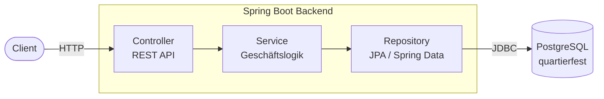
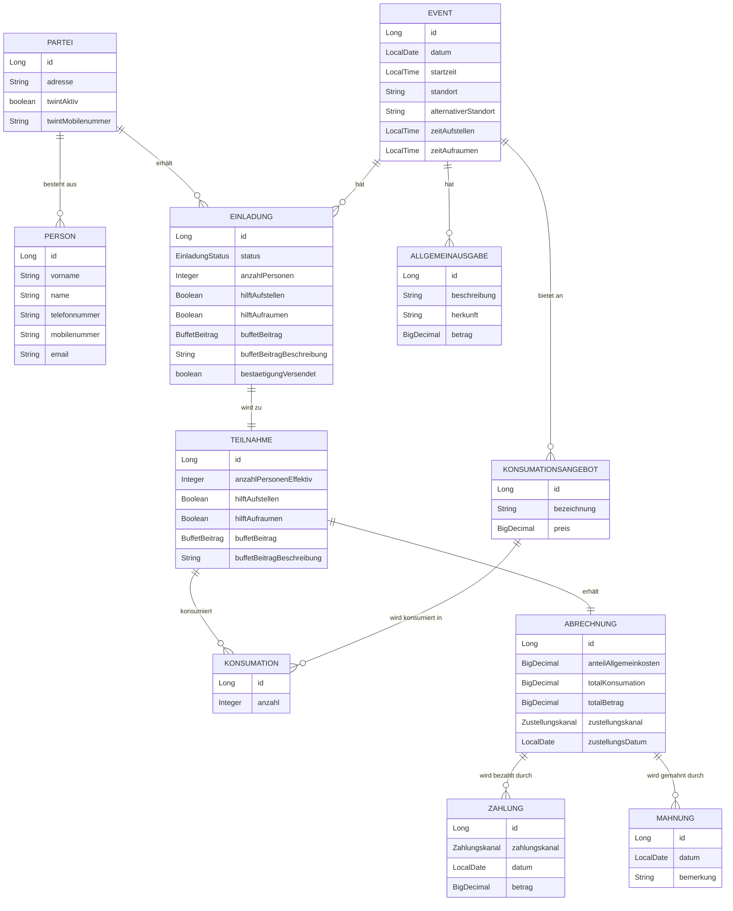

# Architekturdiagramm Quartierfest-Backend

## Schichtenarchitektur

---

## Domänenmodell (Entity-Beziehungen)

---

## REST-Endpunkte

| Domain              | Endpunkt                      | GET | POST | DELETE |
|---------------------|-------------------------------|:---:|:----:|:------:|
| Person              | `/api/persons`                | ✓   | ✓    | ✓      |
| Partei              | `/api/parteien`               | ✓   | ✓    | ✓      |
| Event               | `/api/events`                 | ✓   | ✓    | ✓      |
| Einladung           | `/api/einladungen`            | ✓   | ✓    | ✓      |
| Teilnahme           | `/api/teilnahmen`             | ✓   | ✓    | ✓      |
| Konsumationsangebot | `/api/konsumationsangebote`   | ✓   | ✓    | ✓      |
| Konsumation         | `/api/konsumationen`          | ✓   | ✓    | ✓      |
| Allgemeinausgabe    | `/api/allgemeinausgaben`      | ✓   | ✓    | ✓      |
| Abrechnung          | `/api/abrechnungen`           | ✓   | ✓    | ✓      |
| Zahlung             | `/api/zahlungen`              | ✓   | ✓    | ✓      |
| Mahnung             | `/api/mahnungen`              | ✓   | ✓    | ✓      |
