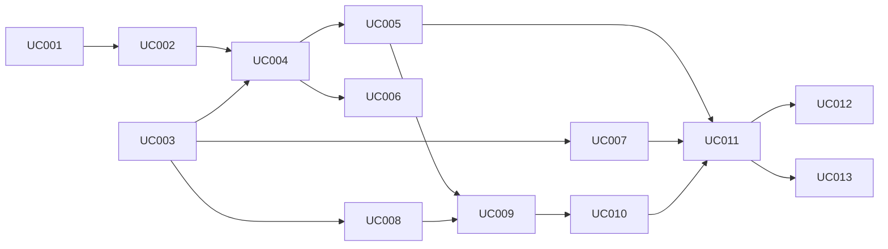

# Use-Case-Diagramm Quartierfest

> Stand: 2026-04-10

## Aktoren

| Aktor | Typ | Beschreibung |
|-------|-----|-------------|
| Organisator | Human | Plant und verwaltet das Quartierfest |
| Partei | External | Haushalt / Gruppe, die eine Einladung erhält |

---

## Diagramm

```mermaid
graph TD
    Org([Organisator])
    Par([Partei\nexternal])

    subgraph Stammdaten
        UC001[UC-001\nPersonendaten verwalten]
        UC002[UC-002\nParteien verwalten]
        UC003[UC-003\nEvent anlegen]
    end

    subgraph Planung
        UC004[UC-004\nEinladung verwalten]
        UC005[UC-005\nTeilnahme erfassen]
        UC006[UC-006\nBestätigung versenden]
        UC007[UC-007\nAllgemeinausgaben verwalten]
        UC008[UC-008\nKonsumationsangebot verwalten]
    end

    subgraph Durchführung
        UC009[UC-009\nKonsumationsliste erstellen]
        UC010[UC-010\nKonsumation übernehmen]
    end

    subgraph Nachbearbeitung
        UC011[UC-011\nAbrechnung erstellen]
        UC012[UC-012\nAbrechnung zustellen]
        UC013[UC-013\nInkasso sicherstellen]
    end

    Org --> UC001
    Org --> UC002
    Org --> UC003
    Org --> UC004
    Org --> UC005
    Org --> UC006
    Org --> UC007
    Org --> UC008
    Org --> UC009
    Org --> UC010
    Org --> UC011
    Org --> UC012
    Org --> UC013

    Par -.->|erhält Einladung| UC004
    Par -.->|erhält Bestätigung| UC006
    Par -.->|erhält Abrechnung| UC012
    Par -.->|zahlt / wird gemahnt| UC013
```

---

## UC-Übersicht nach Phase

### Phase 1 – Stammdaten

| UC-ID | Name | Endpunkte | Status |
|-------|------|-----------|--------|
| UC-001 | Personendaten verwalten | GET/POST/PUT/DELETE `/api/persons` | ✅ Vollständig |
| UC-002 | Parteien verwalten | GET/POST/PUT/DELETE `/api/parteien` | ✅ Vollständig |
| UC-003 | Event anlegen | GET/POST/PUT/DELETE `/api/events` | ✅ Vollständig |

### Phase 2 – Planung

| UC-ID | Name | Endpunkte | Status |
|-------|------|-----------|--------|
| UC-004 | Einladung verwalten | GET/POST/DELETE `/api/einladungen` | ✅ Vollständig |
| UC-005 | Teilnahme erfassen | GET/POST/DELETE `/api/teilnahmen` | ✅ Vollständig |
| UC-006 | Bestätigung versenden | POST `/api/einladungen` (Upsert) | ✅ Vollständig |
| UC-007 | Allgemeinausgaben verwalten | GET/POST/DELETE `/api/allgemeinausgaben` | ✅ Vollständig |
| UC-008 | Konsumationsangebot verwalten | GET/POST/DELETE `/api/konsumationsangebote` | ✅ Vollständig |

### Phase 3 – Durchführung

| UC-ID | Name | Endpunkte | Status |
|-------|------|-----------|--------|
| UC-009 | Konsumationsliste erstellen | GET `/api/konsumationsangebote`, GET `/api/teilnahmen` | ⚠ Teilimpl. |
| UC-010 | Konsumation übernehmen | GET/POST/DELETE `/api/konsumationen` | ✅ Vollständig |

### Phase 4 – Nachbearbeitung

| UC-ID | Name | Endpunkte | Status |
|-------|------|-----------|--------|
| UC-011 | Abrechnung erstellen | GET/POST/DELETE `/api/abrechnungen` | ⚠ Teilimpl. |
| UC-012 | Abrechnung zustellen | POST `/api/abrechnungen` (Upsert) | ✅ Vollständig |
| UC-013 | Inkasso sicherstellen | GET/POST/DELETE `/api/zahlungen`, `/api/mahnungen` | ✅ Vollständig |

---

## Abhängigkeiten zwischen Use Cases

